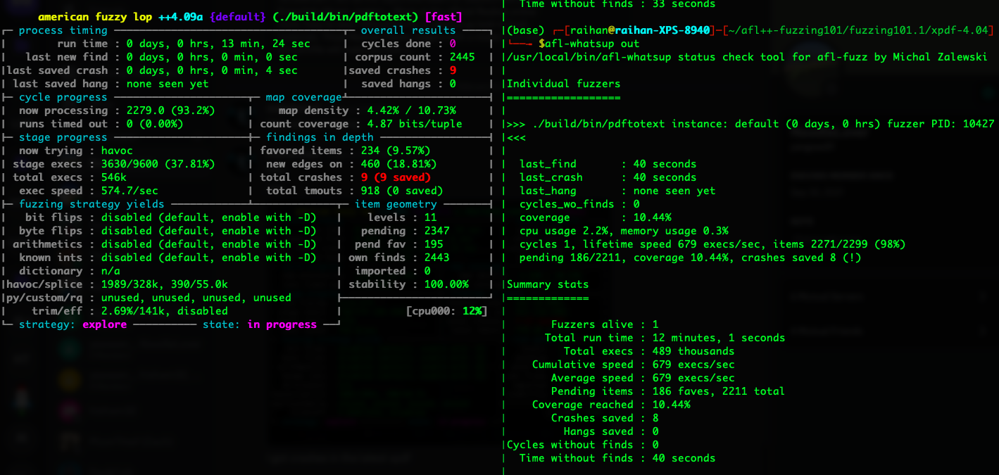
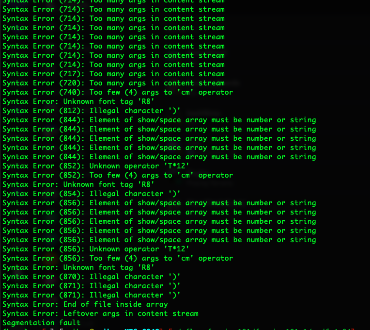

# Afl++ testing
While fuzzing the new `xpdf-4.04` with afl++, I found the actual bugs.

Here are the crashes,

Following inputs were given to it,

These are real errors giving segmentation fault,

The crashes can be found at this location `./fuzzing101.1/xpdf-4.04/out/default/crashes` 
